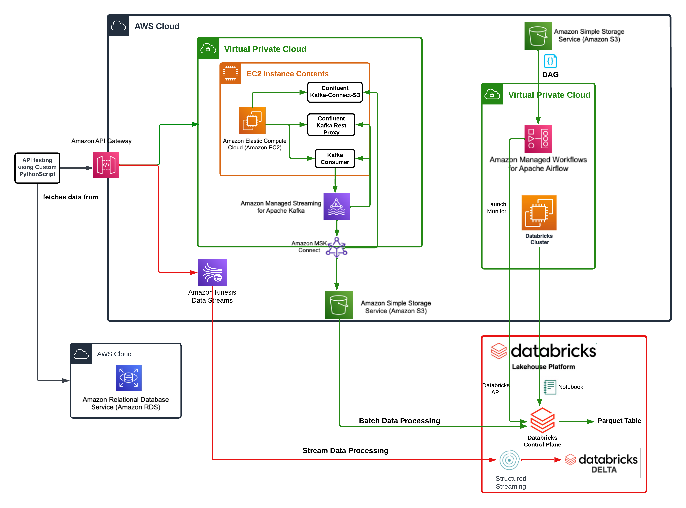

# Pinterest Data Pipeline

## Table of Contents

- [Project Breif](#project-breif)
- [Data](#data)
- [Project Tools](#project-tools)
- [Project Archetechture Diagram](#project-archetechture-diagram)
- [Milestone 3](#milestone-3--configure-the-ec2-kafka-client)
- [Milestone 4](#milestone-4--connect-a-msk-cluster-to-a-s3-bucket)
- [Milestone 5](#milestone-5-configuring-an-api-gateway)
- [Milestone 6](#milestone-6-set-up-databricks)
- [Milestone 7](#milestone-7-spark-usage-in-databricks)
- [Milestone 8](#milestone-8-aws-mwaa)
- [Milestone 9](#milestone-9-aws-kinesis)

## Project Breif

Build the system that Pinterest uses to analyse both historical, and real-time data generated by posts from their users.

Pinterest operates cutting-edge machine learning engineering systems, handling billions of daily user interactions, including image uploads and clicks. The project at hand involves developing a cloud-based system that processes these events through two distinct pipelines. One pipeline focuses on computing real-time metrics, such as profile popularity, to inform immediate recommendations. The other pipeline is dedicated to calculating metrics that rely on historical data, like determining the users with the most followers per country.

## Data 
In order to emulate the kind of data that Pinterest's engineers are likely to work with, this project contains a script, user_posting_emulation_to_console.py that when run from the terminal mimics the stream of random data points received by the Pinterest API when POST requests are made by users uploading data to Pinterest.

Running the script instantiates a database connector class, which is used to connect to an AWS RDS database containing the following tables:

pinterest_data contains data about posts being updated to Pinterest
geolocation_data contains data about the geolocation of each Pinterest post found in pinterest_data
user_data contains data about the user that has uploaded each post found in pinterest_data
The run_infinite_post_data_loop() method infinitely iterates at random intervals between 0 and 2 seconds, selecting all columns of a random row from each of the three tables and writing the data to a dictionary. The three dictionaries are then printed to the console.

Examples of the data generated look like the following:

pinterest_data:

    {'index': 7528, 'unique_id': 'fbe53c66-3442-4773-b19e-d3ec6f54dddf', 'title': 'No Title Data Available', 'description': 'No description available Story format', 'poster_name': 'User Info Error', 'follower_count': 'User Info Error', 'tag_list': 'N,o, ,T,a,g,s, ,A,v,a,i,l,a,b,l,e', 'is_image_or_video': 'multi-video(story page format)', 'image_src': 'Image src error.', 'downloaded': 0, 'save_location': 'Local save in /data/mens-fashion', 'category': 'mens-fashion'}

geolocation_data:

{'ind': 7528, 'timestamp': datetime.datetime(2020, 8, 28, 3, 52, 47), 'latitude': -89.9787, 'longitude': -173.293, 'country': 'Albania'}

user_data:

{'ind': 7528, 'first_name': 'Abigail', 'last_name': 'Ali', 'age': 20, 'date_joined': datetime.datetime(2015, 10, 24, 11, 23, 51)}

## Project Tools 
- [AWS API Gateway](https://aws.amazon.com/api-gateway/) - AWS API Gateway is a fully managed service that enables developers to create, deploy, and manage APIs at any scale. This project used this to build multiple API connections.

- [AWS Kinesis](https://aws.amazon.com/kinesis/) - AWS Kinesis is a managed service for processing and analysing streaming data. In this project I've used Kinesis Data Streams to collect and store data temporarily before using Spark on Databricks to read and process the stream.

- [AWS MSK](https://aws.amazon.com/msk/) - Amazon Managed Streaming for Apache Kafka (Amazon MSK) is a fully managed service that enables you to build and run applications that use Apache Kafka to process streaming data

- [AWS MSK Connect](https://docs.aws.amazon.com/msk/latest/developerguide/msk-connect.html) - MSK Connect is a feature of Amazon MSK that makes it easy for developers to stream data to and from their Apache Kafka clusters.

- [Apache Kafka](https://kafka.apache.org/) - Apache Kafka is an event streaming platform. Event streaming is the practice of capturing data in real-time from event sources like databases, mobile devices, cloud services and more. This project used Apache Kafka to collect and funnel batch and streaming data to their intended destinations.

- [Apache Spark](https://spark.apache.org/docs/3.4.1/) - Apache Spark™ is a multi-language engine for executing data engineering, data science, and machine learning on single-node machines or clusters. This project used spark to use pyspark to transform the data.

- [Kafka REST Proxy](https://docs.confluent.io/platform/current/kafka-rest/index.html) - Kafka REST Proxy is utilised to enable HTTP-based communication with Apache Kafka, allowing clients to produce and consume messages over RESTful APIs. This project used this to allow AWS kinesis and S3 (clients) to consume the pinterest data.

- [PySpark](https://spark.apache.org/docs/3.4.1/api/python/index.html) - PySpark is the Python API for Apache Spark. This project used pyspark to transform batch and streaming data into useable information.

- [Databricks](https://docs.databricks.com/en/index.html) - This project uses the Databricks platform to perform Spark processing of batch and streaming data.

- [Managed Workflows for Apache Airflow](https://docs.aws.amazon.com/mwaa/latest/userguide/what-is-mwaa.html) - Apache Airflow enables users to use Python to build scheduling workflows for batch-oriented processes. This project uses MWAA to orchestrate batch processing on the Databricks platform

## Project Archetechture Diagram

## Milestone 3 : Configure the EC2 Kafka client
#### Goal: 

Configure an Amazon EC2 instance to create 3 kafka topics

Tasks:

1. Creating a .pem key
    - Navigated to AWS Parameter Store to find the key pair value and saved it as "parameter_value.pem". 

2. Connecting to EC2 
    - Connected my local device into AWS EC2 by running the code inside a terminal:
    ~~~Python
    ssh -i "parameter_value.pem" root@ec2-54-236-200-157.compute-1.amazonaws.com
    ~~~

3. Set up Kafka in EC2 instance
    - Once the EC2 was connected, Kafka was installed and client.properties file was created to configure Kafka Client to use AWS IAM authentication to the cluster.

client.properties file contains:

~~~Python
# Sets up TLS for encryption and SASL for authN.
security.protocol = SASL_SSL

# Identifies the SASL mechanism to use.
sasl.mechanism = AWS_MSK_IAM

# Binds SASL client implementation.
sasl.jaas.config = software.amazon.msk.auth.iam.IAMLoginModule required awsRoleArn="arn:aws:iam::584739742957:role/12863e427a8f-ec2-access-role";

# Encapsulates constructing a SigV4 signature based on extracted credentials.
# The SASL client bound by "sasl.jaas.config" invokes this class.
sasl.client.callback.handler.class = software.amazon.msk.auth.iam.IAMClientCallbackHandler
~~~

4. Creating Kafka Topics
    - Before creating my topi, I had to get my MSK cluster specific Bootstrap servers string and Plaintext Apache Zookeeper connection string.
    - Using the correct strings, I managed to create 3 topics:
        - 12863e427a8f.pin
        - 12863e427a8f.geo
        - 12863e427a8f.user

The topics were created using this code below:
~~~Python
./kafka-topics.sh --bootstrap-server BootstrapServerString --command-config client.properties --create --topic 12863e427a8f.pin
~~~

## Milestone 4 : Connect a MSK cluster to a S3 bucket
#### Goal: Use MSK Connect to connect the MSK cluster to a S3 bucket, such that any data going through the cluster will be automatically saved and stored in a dedicated S3 bucket.

Tasks:

1. Creating a custom plugin with MSK Connect
    - Before a custom plugin can be created inside MSK, Confluent.io Amazon S3 connector needs to be downloaded inside my EC2 client.

    ~~~python
    wget https://d1i4a15mxbxib1.cloudfront.net/api/plugins/confluentinc/kafka-connect-s3/versions/10.0.3/confluentinc-kafka-connect-s3-10.0.3.zip
    ~~~

    - Inside the MSK Connect console, a custom plugin can be then set with the Confluent connector ZIP file inside a bucket

2. Creating a connector with MSK Connect

    - Inside MSK console, the connector configuration settings has been tweaked so it links to my own UUID and a specific S3 bucket.
    ~~~python
    connector.class=io.confluent.connect.s3.S3SinkConnector
    # same region as our bucket and cluster
    s3.region=us-east-1
    flush.size=1
    schema.compatibility=NONE
    tasks.max=3
    # include nomeclature of topic name, given here as an example will read all data from topic names starting with msk.topic....
    topics.regex=<YOUR_UUID>.*
    format.class=io.confluent.connect.s3.format.json.JsonFormat
    partitioner.class=io.confluent.connect.storage.partitioner.DefaultPartitioner
    value.converter.schemas.enable=false
    value.converter=org.apache.kafka.connect.json.JsonConverter
    storage.class=io.confluent.connect.s3.storage.S3Storage
    key.converter=org.apache.kafka.connect.storage.StringConverter
    s3.bucket.name=<BUCKET_NAME>
    ~~~

## Milestone 5: Configuring an API Gateway
#### Goal: To build my own API that sends data to the MSK cluter, which in turn will be stored in an S3 bucket.

Tasks: 
1. Build a Kafka REST Proxy
    - Inside AWS API Gateway, a resource is created that allows a PROXY integration to my API.
    - This PROXY then contains a HTTP ANY method, that has my EC2 PublicDNS as its Endpoint URL

2. Set up the REST Proxy inside EC2 client
    - Before the REST Proxy can be run inside the EC2 client, a Confluent package needs to be installed inside the client first.

    ~~~python
    sudo wget https://packages.confluent.io/archive/7.2/confluent-7.2.0.tar.gz
    ~~~

    - Inside the confluent/etc/kafka-rest folder, a kafka-rest.properties file is editted to perform IAM authentication to the MSK cluster

    ~~~python
    client.security.protocol = SASL_SSL

    # Identifies the SASL mechanism to use.
    client.sasl.mechanism = AWS_MSK_IAM

    # Binds SASL client implementation.
    client.sasl.jaas.config = software.amazon.msk.auth.iam.IAMLoginModule required awsRoleArn="arn:aws:iam::584739742957:role/12863e427a8f-ec2-access-role";

    # Encapsulates constructing a SigV4 signature based on extracted credentials.
    # The SASL client bound by "sasl.jaas.config" invokes this class.
    client.sasl.client.callback.handler.class = software.amazon.msk.auth.iam.IAMClientCallbackHandler
    ~~~

    - The REST proxy can be then run inside the EC2 client with the code below:
    ~~~python
    # This code needs to be run inside confluent/bin folder
    ./kafka-rest-start /home/ec2-user/confluent-7.2.0/etc/kafka-rest/kafka-rest.properties
    ~~~

3. Send data to the API
    - Data is sent into the API by tweaking the user_posting_emulation.py
    ~~~python
    #This function is called after every pin, geo, and user data is collected
    def post_data_to_kafka(url, payload_data):
        return requests.request("POST", new_connector.read_db_creds()[url], headers=new_connector.read_db_creds()['headers'], data= payload_data)

    for row in pin_selected_row:
                pin_result = dict(row._mapping)
    pin_payload = json.dumps({
                "records": [
                    {
                    "value": {
                        "index": pin_result["index"], 
                        "unique_id": pin_result["unique_id"], 
                        "title": pin_result["title"], 
                        "description": pin_result["description"],
                        "poster_name": pin_result["poster_name"],
                        "follower_count": pin_result["follower_count"],
                        "tag_list": pin_result["tag_list"],
                        "is_image_or_video": pin_result["is_image_or_video"],
                        "image_src": pin_result["image_src"],
                        "downloaded": pin_result["downloaded"],
                        "save_location": pin_result["save_location"],
                        "category": pin_result["category"]}
                    }
                ]
            })            
    response = post_data_to_kafka('invoke_url_pin', pin_payload)
    ~~~
## Milestone 6: Set up Databricks
#### Goal: Mount S3 bucket inside Databricks

Tasks:

1. Mount an S3 bucket into Databricks 
    - First we need to read the CSV file that contains our AWS keys inside Databricks
    ~~~Python
    # pyspark functions
    from pyspark.sql.functions import *
    # URL processing
    import urllib

    # Specify file type to be csv
    file_type = "csv"
    # Indicates file has first row as the header
    first_row_is_header = "true"
    # Indicates file has comma as the delimeter
    delimiter = ","
    # Read the CSV file to spark dataframe
    aws_keys_df = spark.read.format(file_type)\
    .option("header", first_row_is_header)\
    .option("sep", delimiter)\
    .load("/FileStore/tables/authentication_credentials.csv")
    ~~~

    - Access key and Secret Access Key is required to mount a S3 bucket into Databricks. This can be extracted with this following code:

    ~~~python
    # Get the AWS access key and secret key from the spark dataframe
    ACCESS_KEY = aws_keys_df.where(col('User name')=='databricks-user').select('Access key ID').collect()[0]['Access key ID']
    SECRET_KEY = aws_keys_df.where(col('User name')=='databricks-user').select('Secret access key').collect()[0]['Secret access key']
    # Encode the secrete key
    ENCODED_SECRET_KEY = urllib.parse.quote(string=SECRET_KEY, safe="")
    ~~~

    - With the Access Key and Encoded Secret Key, a S3 bucket can be then mounted into Databricks with this code:

    ~~~python
    # AWS S3 bucket name
    AWS_S3_BUCKET = "user-12863e427a8f-bucket"
    # Mount name for the bucket
    MOUNT_NAME = "/mnt/Nathan_12863e427a8f"
    # Source url
    SOURCE_URL = "s3n://{0}:{1}@{2}".format(ACCESS_KEY, ENCODED_SECRET_KEY, AWS_S3_BUCKET)
    # Mount the drive
    dbutils.fs.mount(SOURCE_URL, MOUNT_NAME)
    ~~~

2. Create a dataframe for each topic
~~~python

def Read_data_from_S3(filepath_to_data_objects):
    file_location = f"/mnt/Nathan_12863e427a8f/topics/{filepath_to_data_objects}*.json" 
    
    file_type = "json"
    infer_schema = "true"

    df = spark.read.format(file_type) \
    .option("inferSchema", infer_schema) \
    .load(file_location)

    display(df)
    return df

df_pin = Read_data_from_S3("12863e427a8f.pin/partition=0/")
df_geo = Read_data_from_S3("12863e427a8f.geo/partition=0/")
df_user = Read_data_from_S3("12863e427a8f.user/partition=0/")
~~~

## Milestone 7: Spark usage in Databricks
#### Goal: To clean and perform analyses to the data

Tasks:
1. Clean each dataframe
    - All dataframed had duplicated removed starting the cleaning process
    ~~~python
    df_user = df_user.drop_duplicates([column_name for column_name, data_type in df_user.dtypes])
    df_user.count()
    df_pin = df_pin.drop_duplicates([column_name for column_name, data_type in df_pin.dtypes])
    df_pin.count()
    df_geo = df_geo.drop_duplicates([column_name for column_name, data_type in df_geo.dtypes])
    df_geo.count()
    ~~~

    - Cleaning df_pin dataframe
    ~~~python
    # Replace null values into None
    df_pin = df_pin.withColumn("category", when(df_pin["category"].isNull(), None).otherwise(df_pin["category"]))
    df_pin = df_pin.withColumn("description", when(df_pin["description"].isNull(), None).otherwise(df_pin["description"]))

    # Replace entries with no relevant data into None
    df_pin = df_pin.withColumn("description", when(col("description").contains("No description"), None).otherwise(col("description")))
    df_pin = df_pin.withColumn("description", when(col("description").contains("Untitled"), None).otherwise(col("description")))
    df_pin = df_pin.withColumn("follower_count", when(col("follower_count").contains("User Info Error"), None).otherwise(col("follower_count")))
    df_pin = df_pin.withColumn("image_src", when(col("image_src").contains("Image src error"), None).otherwise(col("image_src")))
    df_pin = df_pin.withColumn("tag_list", when(col("tag_list").isin(["N,o, ,T,a,g,s, ,A,v,a,i,l,a,b,l,e"]), None).otherwise(col("tag_list")))
    df_pin = df_pin.withColumn("poster_name", when(col("poster_name").contains("User Info Error"), None).otherwise(col("poster_name")))
    df_pin = df_pin.withColumn("title", when(col("title").contains("No Title Data Available"), None).otherwise(col("title")))

    # Change M and k inside follower_column into its coresponding value
    df_pin = df_pin.withColumn("follower_count", regexp_replace(df_pin["follower_count"], "M", "000000"))
    df_pin = df_pin.withColumn("follower_count", regexp_replace(df_pin["follower_count"], "k", "000"))

    # Change follower_count data type into int
    df_pin = df_pin.withColumn("follower_count", df_pin["follower_count"].cast("int"))

    # Ensuring that each column containing numeric data has a numeric data type
    df_pin = df_pin.withColumn("downloaded", df_pin["downloaded"].cast("int"))
    df_pin = df_pin.withColumn("index", df_pin["index"].cast("int"))

    # Cleaning the save_location column
    df_pin = df_pin.withColumn("save_location", regexp_replace(df_pin["save_location"], "Local save in", ""))

    # Renaming index column into ind column
    df_pin = df_pin.withColumnRenamed("index", "ind")

    # Reorder dataframe columns
    df_pin = df_pin.select(["ind", "unique_id", "title", "description", "follower_count", "poster_name", "tag_list", "is_image_or_video", "image_src", "save_location", "category"])
    ~~~

    - Cleaning df_geo dataframe
    ~~~python 
    # Create an new column coordinates
    df_geo = df_geo.withColumn("coordinates", array(col("latitude"), col("longitude")))

    # Dropping columns Latitude & Longitude
    df_geo = df_geo.drop("latitude", "longitude")

    # Converting timestamp into a timestamp data type
    df_geo = df_geo.withColumn("timestamp", df_geo["timestamp"].cast("timestamp"))

    # Reordering columns
    df_geo = df_geo.select(["ind", "country", "coordinates", "timestamp"])
    ~~~

    - Cleaning df_user dataframe
    ~~~python
    # Creating username column
    df_user = df_user.withColumn("user_name", concat(col("first_name"), col("last_name")))

    # Dropping first and last name columns
    df_user = df_user.drop("first_name", "last_name")  

    # Coverting date_joined column into a timestamp
    df_user = df_user.withColumn("date_joined", df_user["date_joined"].cast("timestamp"))

    # Reodering columns
    df_user = df_user.select(["ind","user_name","age","date_joined"])
    ~~~

2. Querying the data
    - Before querying the data, I created a temporary view in Spark SQL with the specified name "pin", "geo", and "user" to make typing the query a lot easier. This is done by running the code below:
    
    ~~~python
    df_pin_clean.createOrReplaceTempView("pin")
    df_geo_clean.createOrReplaceTempView("geo")
    df_user_clean.createOrReplaceTempView("user")
    ~~~

    - The most popular category in each country
    ~~~python
    result = spark.sql("""SELECT country, category, category_count
                        FROM (
                            SELECT country, category, COUNT(*) AS category_count,
                                ROW_NUMBER() OVER (PARTITION BY country ORDER BY COUNT(*) DESC) AS rank
                            FROM geo 
                            JOIN pin 
                            ON pin.ind = geo.ind
                            GROUP BY country, category
                        ) 
                        WHERE rank = 1
                        ORDER BY category_count DESC""")

    display (result)
    ~~~

    - The most popular category per year

    ~~~python
    result = spark.sql("""SELECT post_year, category, category_count
                    FROM (
                        SELECT YEAR(timestamp) as post_year, category, COUNT(*) as category_count,
                            ROW_NUMBER() OVER (PARTITION BY YEAR(timestamp) ORDER BY COUNT(*) DESC) AS rank
                            FROM geo
                            JOIN pin
                            ON pin.ind = geo.ind
                            GROUP BY YEAR(timestamp), category
                    )
                    WHERE rank = 1
                    ORDER BY category_count DESC""")

    display (result)
    ~~~

    - The user with the most follower per country
    ~~~python
    result = spark.sql("""SELECT country, poster_name, MAX(follower_count) as follower_count
                    FROM pin
                    JOIn geo
                    ON geo.ind = pin.ind
                    GROUP BY country, poster_name
                    ORDER BY follower_count DESC""")

    display(result)
    ~~~

    - The country with the most followers
    ~~~python
    result = spark.sql("""SELECT country, MAX(follower_count) as follower_count
                    FROM pin
                    JOIn geo
                    ON geo.ind = pin.ind
                    GROUP BY country
                    ORDER BY follower_count DESC
                    LIMIT 1""")

    display(result)
    ~~~

    - The most popular category per age groups
    ~~~python 
    result = spark.sql("""
        SELECT age_group, category, category_count
        FROM (
            SELECT age_group, category, category_count,
                ROW_NUMBER() OVER (PARTITION BY age_group ORDER BY category_count DESC) AS rank
            FROM (
                SELECT
                    CASE
                        WHEN age BETWEEN 18 AND 24 THEN "18-24"
                        WHEN age BETWEEN 25 AND 35 THEN "25-35"
                        WHEN age BETWEEN 36 AND 50 THEN "36-50"
                        WHEN age > 50 THEN "50+"
                        ELSE "NONE"
                    END AS age_group, category, COUNT(*) AS category_count
                FROM user
                JOIN pin
                ON pin.ind = user.ind
                GROUP BY age_group, category
                ORDER BY category_count DESC
            )
        )WHERE rank = 1 
        """)

    display(result)
    ~~~
    
    - The median follower count for each age group
    ~~~python
    results = spark.sql("""
                        SELECT CASE 
                        WHEN age BETWEEN 18 AND 24 THEN "18-24"
                        WHEN age BETWEEN 25 AND 35 THEN "25-35"
                        WHEN age BETWEEN 36 AND 50 THEN "36-50"
                        WHEN age > 50 THEN "+50"
                        ELSE "NONE" 
                        END as age_group, PERCENTILE_CONT(0.5) WITHIN GROUP(ORDER BY follower_count) AS median_follower_count
                        FROM user
                        JOIN pin
                        ON pin.ind = user.ind
                        GROUP BY age_group
                        ORDER BY median_follower_count DESC
                        """)
    display(results)
    ~~~

    - The median follower count of users based on joining year and age group
    ~~~python   
    results = spark.sql("""
                        SELECT year(date_joined) as join_year, COUNT(date_joined) as numbers_users_joined
                        FROM user 
                        GROUP by join_year
                        HAVING join_year BETWEEN 2015 and 2020
                        """)

    display(results)
    ~~~

    - The median follower count of users based on joining year
    ~~~python
    results = spark.sql("""
                    SELECT year(date_joined) as join_year, PERCENTILE_CONT(0.5) WITHIN GROUP(ORDER BY follower_count) AS median_follower_count
                    FROM user 
                    JOIN pin
                    ON pin.ind = user.ind
                    GROUP by join_year
                    HAVING join_year BETWEEN 2015 and 2020
                    """)

    display(results)
    ~~~

    - The median follower count of users based on joining year and age group

    ~~~python
    results = spark.sql("""
                        SELECT CASE
                        WHEN age BETWEEN 18 AND 24 THEN "18-24"
                        WHEN age BETWEEN 25 AND 35 THEN "25-35"
                        WHEN age BETWEEN 36 AND 50 THEN "36-50"
                        WHEN age > 50 THEN "+50"
                        ELSE "NONE" 
                        END as age_group, year(date_joined) as join_year, PERCENTILE_CONT(0.5) WITHIN GROUP(ORDER BY follower_count) AS median_follower_count
                        FROM user 
                        JOIN pin
                        ON pin.ind = user.ind
                        GROUP by join_year, age_group
                        HAVING join_year BETWEEN 2015 and 2020
                        ORDER BY join_year ASC, median_follower_count DESC
                        """)

    display(results)
    ~~~

## Milestone 8: AWS MWAA
#### Goal: Orchestrate Databricks workloads on AWS MWAA

Tasks:

1. Create and upload a DAG file into MWAA environment
    - DAG created: 12863e427a8f_dag.py
    - This is uploaded inside S3 bucket name "mwaa-dag-bucket"
2. Manually trigger the DAG to run a Databrixks Notebook
    - Inside MWAA, the DAG is trigger to check if it runs successfully

## Milestone 9: AWS Kinesis
#### Goal: Send streaming data to Kinesis and read this data inside Databricks

Tasks: 

1. Create data stream AWS kinesis
    - Inside AWS Kinesis, 3 data streams were made
        - streaming-12f4a3e5b9c5-pin
        - streaming-12f4a3e5b9c5-geo
        - streaming-12f4a3e5b9c5-user

2. Configure API with Kinesis proxy integration
    - A new resource is made inside AWS API Gateway to integrate Kinesis
        - Added HTTP Headers
        - Added Mapping Templates

3. Send data into Kinesis streams
    - A new file named user_posting_emulation_streaming.py is created to send data into Kinesis stream.
    - After converting each data into the correct data type, this code is ran to send it into the API.
    ~~~python
    response_pin = post_data_to_kenesis('k_invoke_url_pin', pin_payload)
    response_geo = post_data_to_kenesis('k_invoke_url_geo', geo_payload) 
    response_user = post_data_to_kenesis('k_invoke_url_user', user_payload)    
    ~~~

4. Read data into Databricks
    - With Acess Key and Encoded Acess Key, dataframes can be created to each specific data streams.

~~~python
#Pin Data
df_pin = spark \
.readStream \
.format('kinesis') \
.option('streamName','streaming-12863e427a8f-pin') \
.option('initialPosition','earliest') \
.option('region','us-east-1') \
.option('awsAccessKey', ACCESS_KEY) \
.option('awsSecretKey', SECRET_KEY) \
.load()
~~~

~~~python
#Geo Data
df_geo = spark \
.readStream \
.format('kinesis') \
.option('streamName','streaming-12863e427a8f-pin') \
.option('initialPosition','earliest') \
.option('region','us-east-1') \
.option('awsAccessKey', ACCESS_KEY) \
.option('awsSecretKey', SECRET_KEY) \
.load()
~~~

~~~python
#User Data
df_user = spark \
.readStream \
.format('kinesis') \
.option('streamName','streaming-12863e427a8f-pin') \
.option('initialPosition','earliest') \
.option('region','us-east-1') \
.option('awsAccessKey', ACCESS_KEY) \
.option('awsSecretKey', SECRET_KEY) \
.load()
~~~

5. Transform data
    - Before the dataframes can be clean, each dataframe's scheme needs to be defined.

    ~~~python 
    pin_schema = StructType([
    StructField("index", IntegerType()),
    StructField("unique_id", StringType()),
    StructField("title", StringType()),
    StructField("description", StringType()),
    StructField("poster_name", StringType()),
    StructField("follower_count", StringType()),
    StructField("tag_list", StringType()),
    StructField("is_image_or_video", StringType()),
    StructField("image_src", StringType()),
    StructField("downloaded", IntegerType()),
    StructField("save_location", StringType()),
    StructField("category", StringType())
    ])
    geo_schema = StructType([
    StructField("ind", IntegerType()),
    StructField("timestamp", TimestampType()),
    StructField("latitude", DoubleType()),
    StructField("longitude", DoubleType()),
    StructField("country", StringType())
    ])
    user_schema = StructType([
    StructField("ind", IntegerType()),
    StructField("first_name", StringType()),
    StructField("last_name", StringType()),
    StructField("age", StringType()),
    StructField("date_joined", TimestampType())
    ])
    ~~~

    - Each dataframe then needs to be deserialized

    ~~~python
    deserialize_df_pin = df_pin.selectExpr("CAST(data as STRING)")
    deserialize_df_pin = deserialize_df_pin.withColumn("data", from_json(col("data"), pin_schema))
    deserialize_df_pin = deserialize_df_pin.selectExpr("data.*")

    deserialize_df_geo = df_geo.selectExpr("CAST(data as STRING)")
    deserialize_df_geo = deserialize_df_geo.withColumn("data", from_json(col("data"), geo_schema))
    deserialize_df_geo = deserialize_df_geo.selectExpr("data.*")

    deserialize_df_user = df_user.selectExpr("CAST(data as STRING)")
    deserialize_df_user = deserialize_df_user.withColumn("data", from_json(col("data"), user_schema))
    deserialize_df_user = deserialize_df_user.selectExpr("data.*")
    ~~~

    - The data can then be clean the same way as we cleaned it on Milestone 7

6. Write the data to Delta Tables
    - Before it can be send into the delta tables, the checkpoint folder needs to be deleted.

~~~python 
dbutils.fs.rm("/tmp/kinesis/_checkpoints/", True)
~~~

- Then a clean dataframe can be written inside Delta Tables

    ~~~python
    #Writes df_pin_clean dataframe into delta tables
    df_pin_clean.writeStream \
    .format("delta") \
    .outputMode("append") \
    .option("checkpointLocation", "/tmp/kinesis/_checkpoints/") \
    .table("12863e427a8f_pin_table")
    ~~~
